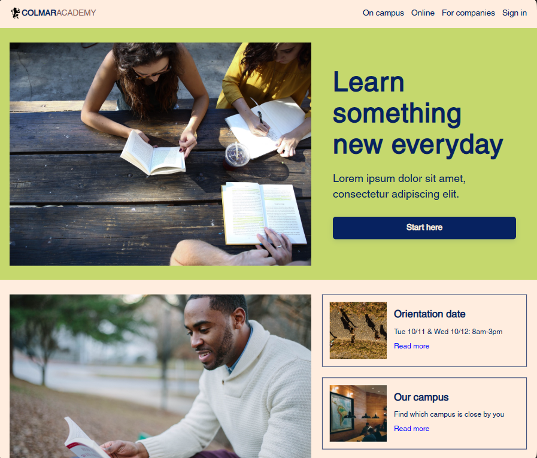

# Colmar Academy – Responsive Website



## Overview

This project is a responsive website built for the **Colmar Academy** design challenge.
The goal was to translate a **desktop and mobile design specification** into a fully functional webpage using HTML and CSS.

The project focuses on building structured layouts, responsive behavior, and clean styling without using frameworks.

## Live Demo

https://amirabenameur3.github.io/Colmar_Academy/

## Design Specification

The website was developed from a provided design spec including **desktop and mobile wireframes**.
The challenge was to reproduce the layout and ensure proper responsiveness across different screen sizes.

## Technologies Used

* HTML5
* CSS3
* Flexbox
* CSS Grid
* Responsive Design
* Git & GitHub

## Features

* Responsive layout for **desktop, tablet, and mobile**
* Flexbox and Grid for layout management
* Responsive navigation with icon-based mobile menu
* Course cards and informational blocks
* Embedded video section
* Clean visual hierarchy and consistent spacing

## What I Practiced

* Translating a design specification into real code
* Structuring HTML using semantic sections
* Building responsive layouts using media queries
* Organizing CSS for maintainability
* Deploying a project using GitHub Pages

## Project Structure

```
Colmar_Academy
│
├── index.html
├── README.md
├── ressources
│   ├── css
│   │   └── style.css
│   ├── images
│   └── videos
└── docs
    ├── colmar-academy-preview.png
    └── colmar-academy-spec.png
```

## Future Improvements

* Improve accessibility (ARIA attributes and semantic enhancements)
* Add subtle UI animations and interactions
* Optimize images and performance
* Refactor CSS for scalability

## Author

Amira Ben Ameur
GitHub: https://github.com/amirabenameur3
